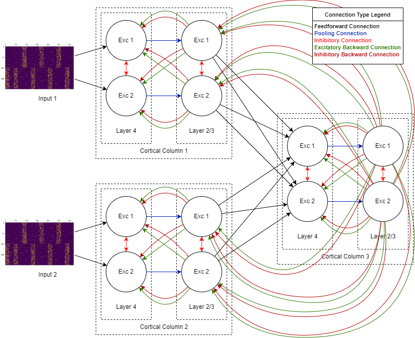

# Master Thesis: Modeling the Mechanisms of Binding Problem in Spiking Neural Networks

## Abstract
Binding problem is one of the important problems in neuroscience, cognitive sciences and philosophy of mind. It's about how a living organism's understanding is integrated from partial concepts formed in the brain. The importance of this problem is in understanding of human cognitive functions, which itself is the part of steps required to designing systems that are capable of processing human-like cognitive functions. Researches show the very strong role of cortical columns, which are structures in the neocortex, in the cognitive functions of living organisms. In this research, we tried to simulate the formation of binding in the brain by modeling the cortical columns and the relationships between them using spiking neural networks. Finally, the tests and investigations carried out on the designed model show the formation of binding in the proposed model. This indicates that probably the cortical columns, as defined structures that can be easily replicated in modeling, are potentially suitable structures to be used in modeling and increase the possibility of forming cognitive processes in the model.

## Directory Structure
This repository is organized into two main directories:
- `latex`: Contains all LaTeX source files used to compose the thesis document. Note that the thesis is written in Persian.
- `python_implementation`: Includes Python scripts and Jupyter Notebook (`.ipynb`) files detailing the implementation of the models discussed in the thesis.


## Visual Representation of the Model


## Citing
If you use the content or code from this thesis in your research, please cite it as follows:
```
Aslani, A. (2023). Modeling the Mechanisms of Binding Problem in Spiking Neural Networks. (Master's thesis, University of Tehran, Tehran, Iran).
```